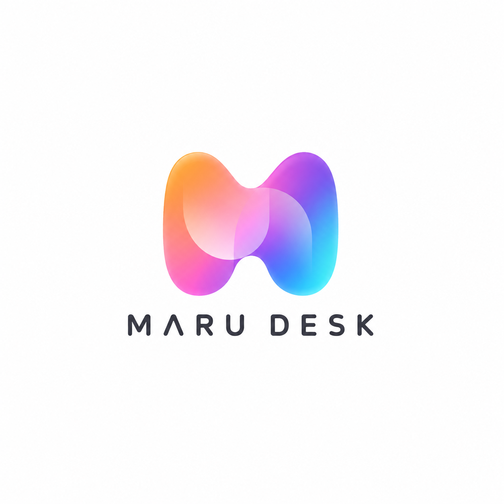
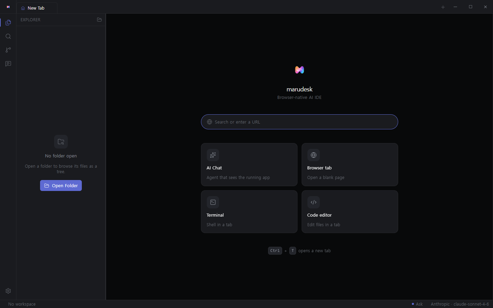
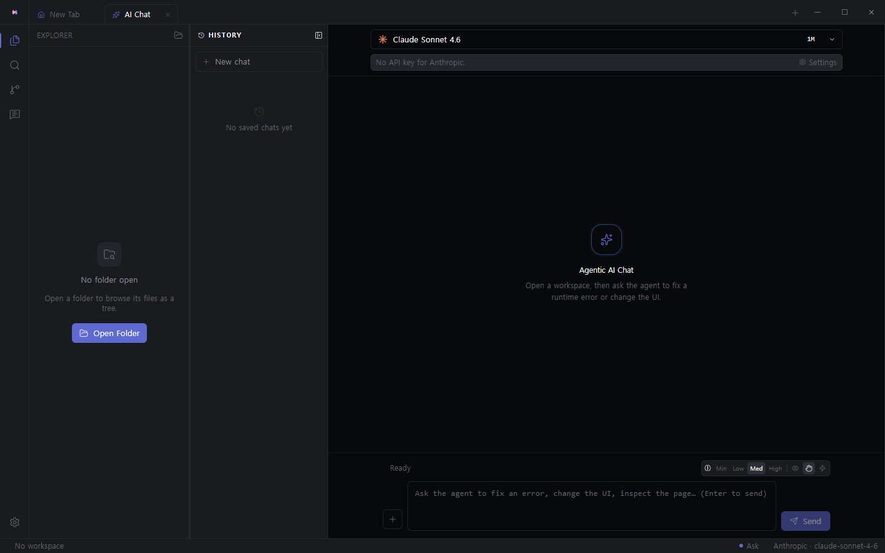
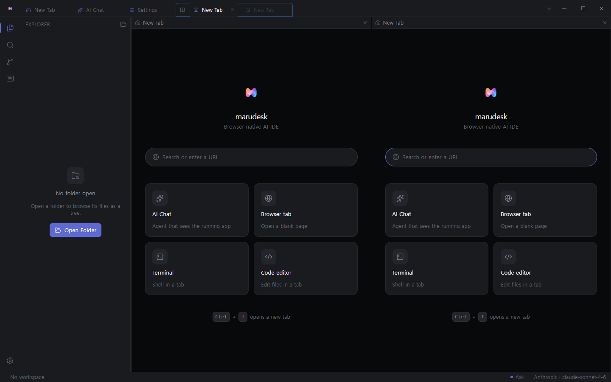

<p align="center">
  
</p>

<p align="center">
  <strong>An agentic workspace where AI sees your <em>running</em> app — not just your source.</strong><br>
  A desktop app that fuses a real web browser, a code editor and terminal, and a multi-provider AI agent.
</p>

<p align="center">
  
</p>

MaruDesk is a desktop application (Electron) for building and debugging web software. Unlike source-only AI coding tools, it embeds a real Chromium browser and speaks the Chrome DevTools Protocol (CDP) in-process, so the agent can read the live DOM, console, and network of the app you are running and act on that runtime evidence — for example, turning a console error into a source fix and confirming the fix by reloading the page.

> Status: in active development — built as a daily driver and portfolio project. See [Project status](#project-status).

## The idea

Most AI coding assistants only see your source files. MaruDesk co-locates the surfaces a developer actually moves between — browser, DevTools, editor, terminal, and the agent — inside one process, and connects the *seams* between them:

- A console error in the embedded DevTools carries a one-click **Fix this**: the agent maps the stack frame back to your source file, edits it, reloads the page, and verifies the error is gone (`get_console_errors → edit → reload_and_verify`).
- The agent can click, type, and scroll the live page, read network requests, and evaluate expressions — the same things you would do by hand in DevTools.
- Because the agent shares the workspace, terminals, and open tabs through an in-process context server, it works from what is actually on screen instead of guessing.

## Screenshots

<table>
  <tr>
    <td width="50%" valign="top">
      <br>
      <sub>Agentic AI chat — model bar, session-history rail, reasoning-effort dial, and the agent composer.</sub>
    </td>
    <td width="50%" valign="top">
      <br>
      <sub>Tabs-as-features on a split-pane grid — browser, editor, terminal, and agent side by side.</sub>
    </td>
  </tr>
</table>

## Features

### Agentic AI chat
- **Many providers, one app.** Anthropic, OpenAI, Google (Gemini), xAI (Grok), Ollama (local), and any custom OpenAI-compatible endpoint (OpenRouter, LM Studio, vLLM, and similar).
- **Bring your own subscription.** Connect by API key, or sign in with an OAuth subscription. Claude (Pro/Max) and xAI work today; ChatGPT and Gemini subscription backends are experimental.
- **Provider fallback chain.** When the active model is rate-limited or errors (429 / 5xx), the agent automatically retries on the next connected model you have ranked, instead of failing the turn.
- **Streaming, reasoning, and control.** Live token streaming, collapsible reasoning blocks, a per-provider reasoning-effort dial, and approval modes (read-only / ask / auto).
- **Sessions and memory.** Resume past conversations from a history rail; keep durable cross-session notes.

### Runtime-aware tools (the differentiator)
- Read console errors with **source mapping** back to workspace files.
- Query the DOM, read network requests and response bodies, evaluate JavaScript.
- Drive the live page: click, fill, press keys, scroll.
- A **reload-and-verify** loop that checks whether a change actually removed the error.
- One-click **Fix this** on console errors.

### A real browser, not a preview
Tabbed browsing on a split-pane grid, with favicons, history, downloads, find-in-page, zoom, configurable search engines, crash recovery, and per-site partitioning.

### Custom DevTools (CDP)
A React-built DevTools dock with Console, Network, Elements, Application, and Rendering panels plus a REPL — dockable or popped out into its own window. Chromium's own DevTools remain available as an escape hatch.

### Editor, terminal, explorer
A Monaco code editor, a real shell terminal (node-pty) with find and copy/paste, a file explorer, and workspace-scoped file tools the agent can use — guarded by configurable never-edit globs.

### Context MCP and external MCP
A built-in, in-process MCP server exposes tabs, the active page, terminals, editor buffers (including unsaved edits), the explorer tree, sessions, and memory to the agent. External MCP servers can also be connected.

### Remote / mobile bridge
Drive your PC's agent from your phone. QR-code pairing, application-level end-to-end encryption (X25519 + AES-GCM), direct LAN / Tailscale transport, and an optional cloud relay for access from anywhere. The phone is a thin client; the model, tools, and workspace always stay on the PC.

## Repository layout

MaruDesk is a three-package workspace.

| Path | Role |
|---|---|
| `marudesk/` | Electron desktop app — browser stage, DevTools, agent loop, editor/terminal, workspace integration, packaging. Owns the model/tool/workspace loop. |
| `mobile/` | Capacitor thin client — phone UI that sends commands and renders PC-owned agent state. Runs no model or tools locally. |
| `relay/` | Node/TypeScript relay and auth service — brokers same-account host/client WebSocket traffic for the cloud-relay path. |

Inside `marudesk/`:

- `electron/` — main process: `browser/*` (tabs, navigation, downloads, CDP runtime capture), `agent/*` (session loop, tools, MCP, context sources, provider auth), plus settings, secrets, and the remote server.
- `src/` — React renderer, organized into feature slices (`features/browser`, `devtools`, `editor`, `agent`, `settings`, `terminal`, and others).
- `shared/` — transport-safe typed contracts used across main, renderer, and tests.
- `e2e/` — Playwright end-to-end tests. `docs/` — design and architecture notes. `DESIGN.md` — design-system rules.

## Tech stack

- **Electron 33**, **React 19**, **TypeScript** (strict project builds)
- **Vite 8** build, **Zustand** state, **Tailwind** design tokens
- **Monaco** editor, **xterm.js** + **node-pty** terminal
- **Vercel AI SDK** (`@ai-sdk/*`) for model integration, **Model Context Protocol SDK** for tools
- **Playwright** for Electron/runtime end-to-end tests

## Getting started

Prerequisites: Node.js 20 or newer and npm. There is no root package; install per package.

```bash
# Desktop app
cd marudesk
npm install
npm run dev        # starts the Vite renderer + Electron shell
```

Optional companion packages:

```bash
cd mobile && npm install && npm run dev    # phone client (web/PWA in dev)
cd relay  && npm install && npm start      # cloud relay (defaults to port 8788)
```

### Configure a provider

Open **Settings → AI Providers** and either paste an API key or sign in with a subscription (OAuth). Then choose a model from the command-palette model picker. To enable automatic failover, turn on **Settings → Agent → Model fallback** and rank your models.

### Build a desktop package

```bash
cd marudesk
npm run build            # type-check + bundle
npm run package:win      # or: npm run package:mac
```

## Development and verification

Run the checks for the package you changed:

```bash
cd marudesk
npm run typecheck
npm run lint
npm run e2e              # Playwright end-to-end suite
```

Targeted main-process and server harnesses:

```bash
npm run harness:server        # remote server (loopback)
npm run harness:e2e           # server end-to-end
npm run harness:pair          # secure device pairing
npm run harness:relay-bridge  # cloud relay bridge
npm run harness:mcp           # MCP tools
```

UI work follows `marudesk/DESIGN.md`: dark-first, restrained, token-based colors only (no hard-coded colors), Lucide icons, and calm, precise copy.

## Project status

MaruDesk is a personal, in-development project used as a daily driver and portfolio piece. Expect rough edges.

- Subscription OAuth for **ChatGPT** and **Gemini** uses undocumented backends and is **experimental**; API-key access and Claude / xAI OAuth are the stable paths.
- MaruDesk is not affiliated with any model provider. Using subscription logins in a third-party client may be subject to each provider's terms — use at your own discretion.
- No open-source license has been granted yet.

## Documentation

- `AGENTS.md` — workspace agent guide and command rules
- `marudesk/README.md` — desktop package details
- `marudesk/DESIGN.md` — design system
- `marudesk/docs/` — product roadmap and architecture / design notes
- `mobile/README.md`, `relay/README.md` — companion packages
